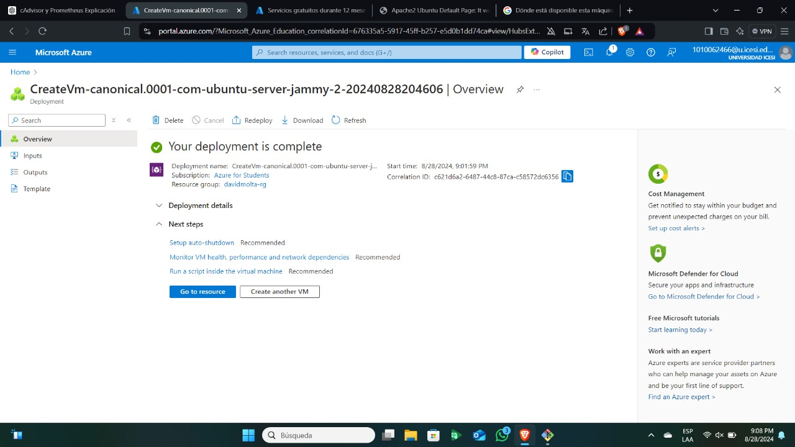
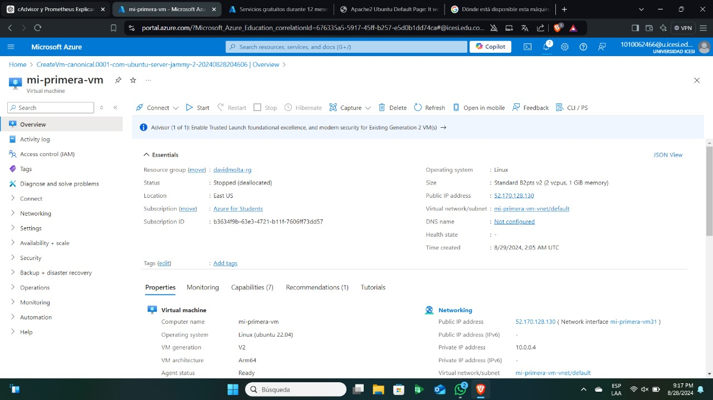

🌐 **Reporte de Configuración de Máquina Virtual en Azure**

📝 **Descripción General**

En esta actividad, desplegamos y configuramos una máquina virtual (VM) en Azure, utilizando una de las opciones más asequibles dentro del plan gratuito para estudiantes. El propósito de esta práctica fue aprender los pasos esenciales para crear y gestionar una VM en la nube de Azure.

💻 **Especificaciones de la Máquina Virtual**

- **Nombre de la VM:** `mi-primera-vm`
- **ID de la Suscripción:** `b3634f9b-63e3-4721-b11f-7606ff73dd57`
- **Ubicación:** `East US` (Elegida por su costo efectivo y proximidad)
- **Tamaño de la VM:** `Standard B2pts v2` (2 vCPUs, 1 GiB de RAM)
- **Sistema Operativo:** Ubuntu Server 22.04 LTS, ARM64

💾 **Detalles de Almacenamiento**

- **Disco del SO:** Utiliza un disco SCSI estándar con Linux instalado.
- **Tipo de Almacenamiento:** Administrado, configurado para eliminarse automáticamente al desmontar la VM, lo que optimiza el manejo de recursos.

🌐 **Configuración de la Red**

- **IP Pública:** `52.170.128.130`
- **Red Virtual/Subred:** `mi-primera-vm-vnet/default`
- **IP Privada:** `10.0.0.4`
- **Nombre DNS:** No configurado.

🔐 **Aspectos de Seguridad**

Para este entorno de práctica, se implementó una configuración de seguridad estándar, sin activar opciones avanzadas como la autenticación multifactor o el cifrado de disco. Se priorizó la simplicidad para facilitar el aprendizaje.

📈 **Opciones de Disponibilidad y Escalabilidad**

- **Zona de Disponibilidad:** No se configuró, ya que los objetivos de la práctica no requerían alta disponibilidad y se buscaba minimizar costos.
- **Escalabilidad:** No se implementaron configuraciones adicionales de escalabilidad, dado el alcance limitado de esta actividad.

🎯 **Reflexión Final**

Esta actividad nos permitió obtener una comprensión práctica de los aspectos básicos en la creación y gestión de una máquina virtual en Azure. Al seleccionar una región económica y aprovechar las ventajas del plan gratuito para estudiantes, logramos optimizar recursos mientras adquiríamos conocimientos valiosos para proyectos futuros en la nube.

Se adjuntan evidencias 

